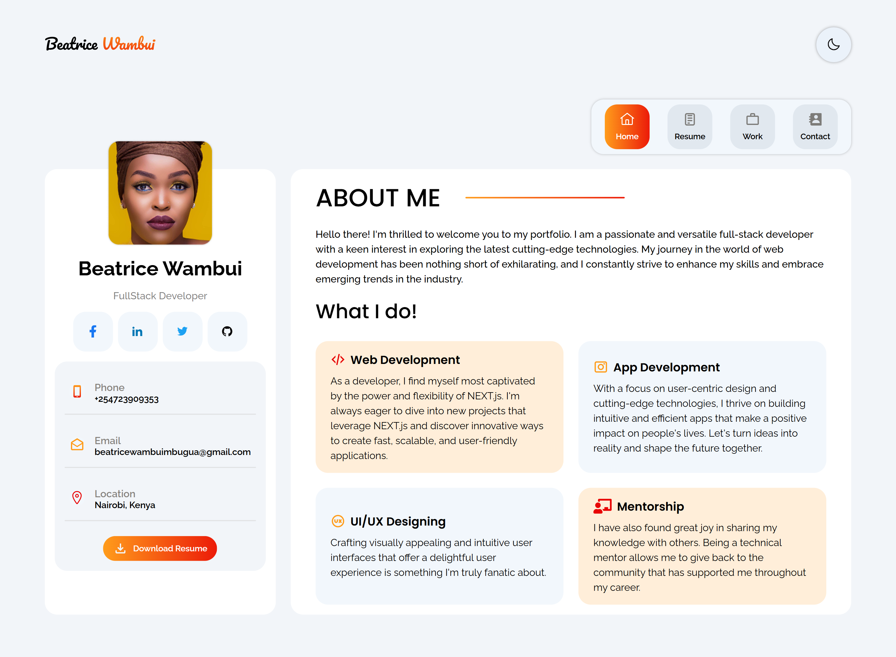
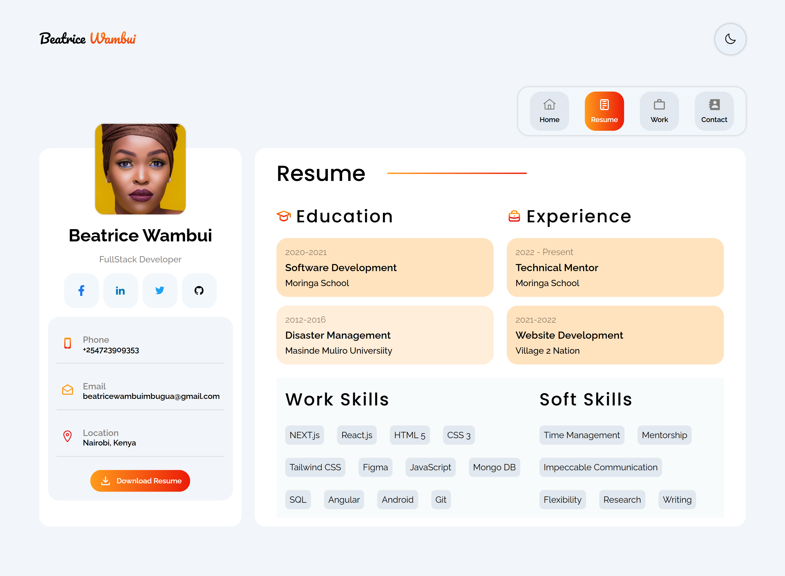
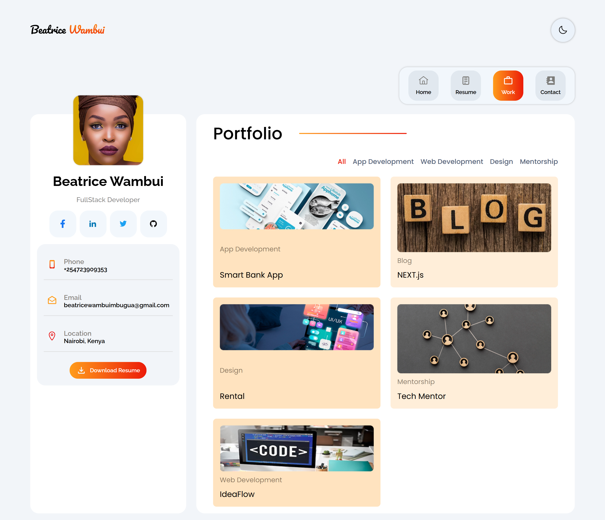
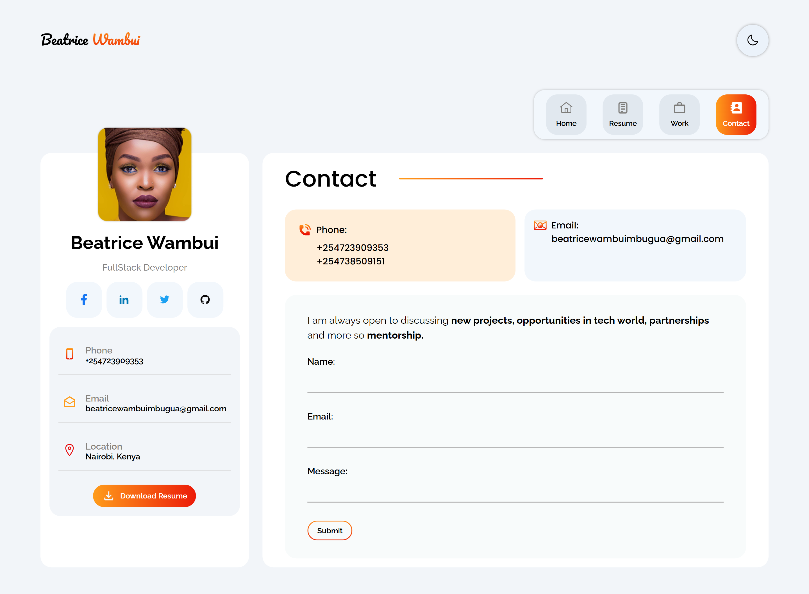

# Beatrice Wambui - Portfolio

A modern, responsive Single Page Application (SPA) designed to showcase my skills, projects, and professional background. 

[Visit Live Site 🚀](https://farhad-deve.github.io/beatriceWambui/)

## 📝 Project Description
This portfolio is built using **React** and **TypeScript**, leveraging **React Router** (`createBrowserRouter`) to deliver a seamless, fluid navigation experience without page reloads. The application uses a modular, component-based architecture and relies entirely on clean, custom CSS3 styling for its responsive layouts.

## 🛠️ Technologies Used
* **Frontend Library**: React (Functional Components & Hooks)
* **Language**: TypeScript (Type safety and scalable code)
* **Routing**: React Router v6 (`RouterProvider` with dynamic base routing)
* **Styling**: Pure CSS3 (Custom classes and responsive layouts)
* **Build Tool**: Vite (Fast compilation and bundle optimization)
* **Hosting**: GitHub Pages

## 📸 Screenshots

### About Me Page

### Resume Page

### Portfolio Page

### Contact Page

